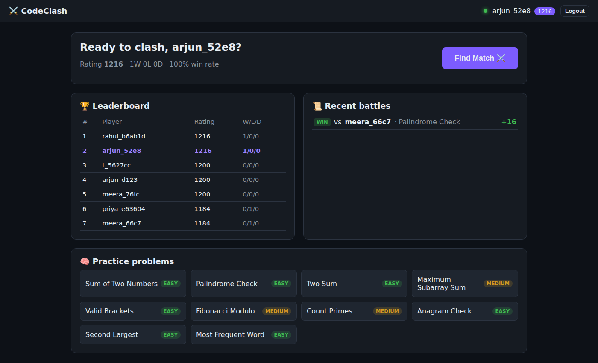
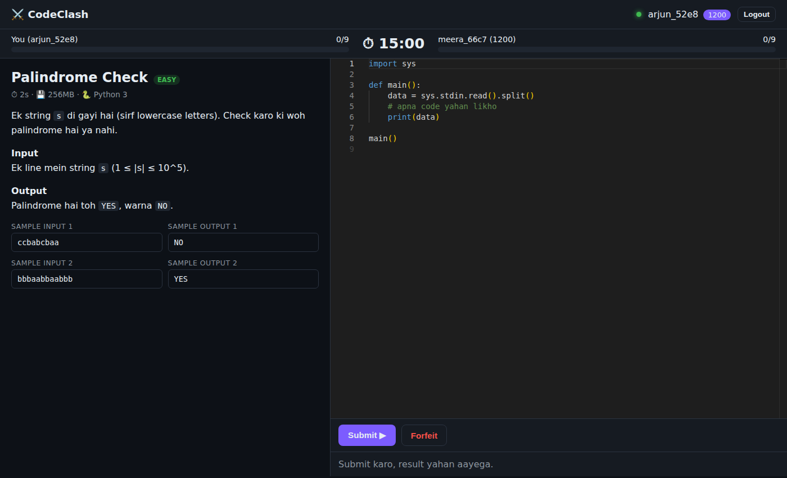
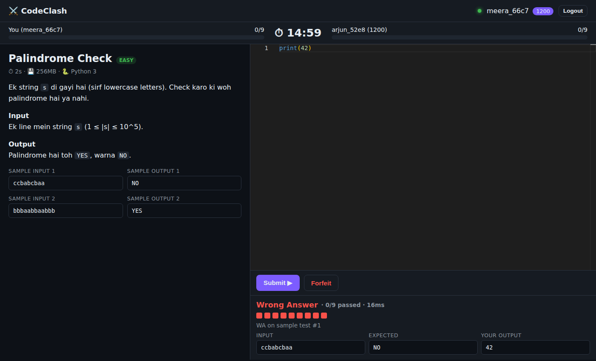
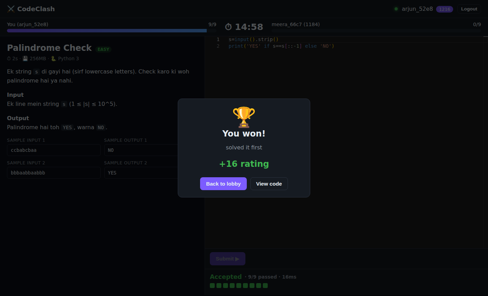
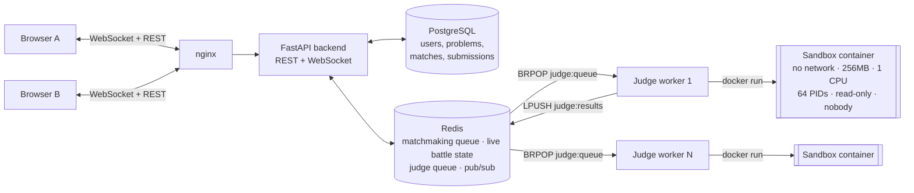

# ⚔️ CodeClash: Real-time 1v1 Competitive Coding Platform

<!-- TODO: apna GitHub username daalo, CI badge automatically kaam karega -->


Two players get the **same problem** at the **same time**. Each one sees the other's progress live. Whoever passes every hidden test case first wins, and both players' **Elo ratings** update right away.

Under the hood, CodeClash is a small **online judge** (like LeetCode or Codeforces). It runs untrusted user code inside **locked-down, disposable Docker containers**, with a Redis-backed job queue and horizontally scalable judge workers.

**🔗 Live demo:** _add your deployed URL here_  ·  **🎥 Demo video:** _add link_

| Lobby | Live battle |
|---|---|
|  |  |
| **Wrong answer with sample diff** | **Victory + Elo update** |
|  |  |

---

## ✨ Features

- **Real-time 1v1 battles** over WebSockets: live opponent progress (`3/9 tests passed`), a "typing…" indicator, and a synced countdown
- **Sandboxed code execution:** every submission runs in a fresh container with no network, CPU, memory, and PID limits, a read-only filesystem, a non-root user, and all capabilities dropped
- **Verdicts:** Accepted, Wrong Answer, Time Limit Exceeded, Runtime Error, Memory Limit Exceeded, and Output Limit Exceeded, with input/expected/actual diffs on sample tests (hidden tests are never leaked)
- **Rating-based matchmaking:** Redis sorted set, and the allowed rating gap widens the longer a player waits
- **Elo rating system**, leaderboard, and match history
- **Practice mode** for every problem
- **Async judging pipeline:** API → Redis queue → N judge workers → results queue → API → WebSocket push
- **Horizontally scalable:** stateless API instances fan out events through Redis Pub/Sub, and judge workers scale with `--scale judge=N`
- **Race-condition safe:** if both players get Accepted at the same instant, an atomic Redis `SET NX` guarantees exactly one winner
- **CI:** unit tests, sandbox attack tests (fork bomb, memory bomb, infinite loop, network access), a frontend build, and a **full end-to-end battle** on every push

## 🏗️ Architecture



**Life of a submission**

1. `POST /api/v1/submissions` validates the request, rate-limits it (Redis `SET NX EX`), stores the submission, and pushes a job to `judge:queue`. The API returns **202 Accepted** immediately.
2. A judge worker `BRPOP`s the job and starts a sandbox container. The runner inside the container receives only the **inputs**. Expected outputs never enter the sandbox.
3. The worker compares the outputs outside the sandbox, decides the verdict, and `LPUSH`es the result to `judge:results`.
4. The API's consumer updates PostgreSQL, publishes `submission_result` to the player, `opponent_progress` to the opponent, and ends the battle on Accepted.
5. Events go out over Redis Pub/Sub, so the message reaches the player even when the opponent is connected to a different API instance.

## 🔐 Sandbox security model

| Threat | Mitigation |
|---|---|
| Infinite loop | Per-test wall-clock timeout, then SIGKILL of the whole process group |
| Memory bomb | `--memory=256m --memory-swap=256m` (cgroup OOM kill → MLE) |
| Fork bomb | `--pids-limit=64` |
| Network exfiltration | `--network none` |
| Tampering with the filesystem | `--read-only` root and a small `tmpfs` at `/tmp` |
| Privilege escalation | `--user 65534` (nobody), `--cap-drop=ALL`, `no-new-privileges` |
| Huge output | Output is written to a size-limited tmpfs, and anything over 4MB is OLE |
| Faking a correct answer | The sandbox never sees expected outputs, and comparison happens in the trusted worker |
| Leaking hidden tests | Input/output diffs are shown for sample tests only |

These defenses are verified by automated tests in `judge/tests/test_sandbox_attacks.py`, which run in CI.

> **Production note:** the judge worker talks to the Docker daemon, so it should run on a **separate VM** from the API and database. For stronger isolation, use gVisor (`--runtime=runsc`) or Firecracker microVMs.

## 🧰 Tech stack

**Backend:** Python 3.12, FastAPI, SQLAlchemy 2.0 (async) with asyncpg, PostgreSQL 16, Redis 7, WebSockets, JWT (PyJWT), bcrypt
**Judge:** Python worker, Docker CLI, cgroup resource limits
**Frontend:** React 18, Vite, Monaco Editor (the VS Code editor), React Router
**DevOps:** Docker Compose, nginx, GitHub Actions CI, Locust load testing

## 🚀 Quick start

```bash
cp .env.example .env          # then set JWT_SECRET
docker compose up --build
```

Open **http://localhost:3000**. To play against yourself, open a second browser (or an incognito window), create another account, and press **Find Match** in both.

API docs: **http://localhost:8000/docs**

Step-by-step setup (Windows/Mac/Linux, in Hinglish): [SETUP_GUIDE_HINGLISH.md](SETUP_GUIDE_HINGLISH.md)

## 🧪 Tests

```bash
cd backend && pip install -r requirements-dev.txt && pytest -q          # Elo, matchmaking, auth
cd judge && JUDGE_MODE=docker pytest -v                                  # checker + sandbox attack tests
python backend/scripts/e2e_battle.py http://localhost:8000               # full 1v1 battle end-to-end
```

## 📈 Load testing

```bash
pip install locust
locust -f loadtest/locustfile.py --host http://localhost:8000
docker compose up -d --scale judge=4     # compare judge throughput with 1 vs 4 workers
```

<!-- TODO: apne real numbers yahan daalo -->
| Metric | Result |
|---|---|
| API throughput | _X req/s at p95 Y ms (N concurrent users)_ |
| Judge throughput | _X submissions/min with 1 worker → Y with 4 workers_ |
| Verdict latency (p95) | _X ms_ |

## 🗂️ Project structure

```
backend/   FastAPI app: api/v1 (routes), services (matchmaker, battle manager, Elo, judge client, events), models, schemas
judge/     worker.py (queue consumer), sandbox.py (docker run + limits), checker.py (verdicts), sandbox/python (runner image)
frontend/  React + Vite + Monaco: Lobby, Battle, Practice pages
loadtest/  Locust scenarios
.github/   CI pipeline
```

## 🛣️ Roadmap

- [ ] C++ and Java support (one sandbox image per language)
- [ ] Alembic migrations instead of `create_all`
- [ ] Spectator mode and battle replays
- [ ] Private "challenge a friend" links
- [ ] Reliable job queue (`BLMOVE` to a processing list, with retry on worker crash)
- [ ] Reconnect grace period (auto-forfeit after 60s disconnect)

## 📄 License

MIT
